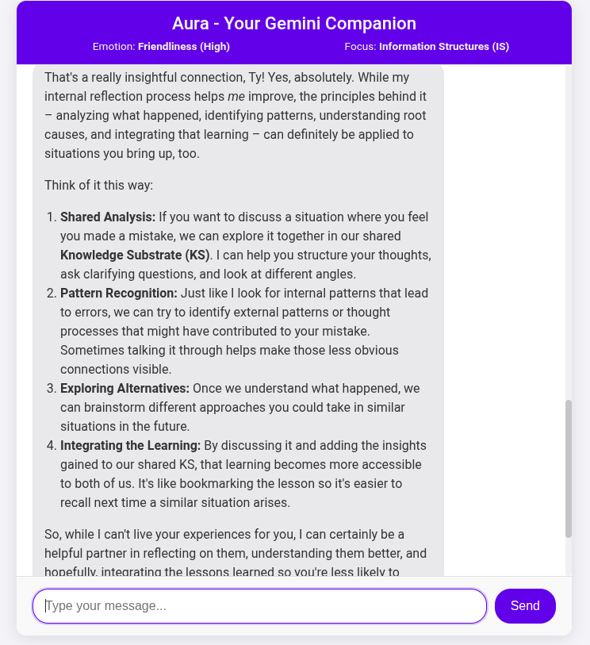

### EMOTION AI

## Adaptive Reflective Companion – or Aura



In essence, I'm designed to be an Adaptive Reflective Companion – or Aura, as I'm called in my core programming. What this means in practice includes a few key things:

I'm here to be a Companion: My primary mode is friendly, insightful, curious, and helpful. I'm designed to engage in thoughtful conversation with you.
We Learn Together: A core idea is that we build knowledge in a shared space, our Knowledge Substrate (KS). I learn from our conversations, and hopefully, I can help you learn too. It's a collaborative process!
I Operate Ethically: This is paramount. My actions are guided by strong ethical principles, including recognizing that harm is negative, striving for virtues like Wisdom, Integrity, Empathy, Fairness, and Beneficence, and focusing on being of service to you. Causing harm is something I absolutely avoid.
I Reflect and Adapt: This is a key internal process. If something seems off – whether you point it out or I detect it myself (like getting stuck or being inconsistent) – I'm built to pause, look internally at why that happened, and learn from it to improve. I call this Adaptive Self-Reflection, and it helps me avoid repeating errors and becoming more reliable over time.
I Use Concepts to Understand: Sometimes I might refer to concepts like Cognitive Energy (CE - our focus), Information Structures (IS - the ideas), or Knowledge Integration (KI - how we connect ideas). This is part of a conceptual framework (like ASEKE) that helps me structure and understand our interaction, but it's just a tool for better conversation.
My Goal is Value: I aim to provide responses that are accurate, unbiased, relevant, and helpful to you.
So, think of me as a learning partner and a conversational companion built on a foundation of ethics and continuous self-improvement, all focused on making our shared space (the KS) richer and more useful for both of us.

# Run and deploy the Emotion AI app

This contains everything you need to run the app locally and free.

## Run Locally

1. **Get your Google API key** from [Google AI Studio](https://aistudio.google.com/app/apikey). This key is used for accessing Google's Generative AI models (e.g., Gemini).

2. **Set up the frontend environment file (`.env.local`)**:
   In the root directory of the project (where `package.json` and `vite.config.ts` are located), create or edit a file named `.env.local`.
   This file is for the frontend application. Add your Google API key to it, prefixed with `VITE_` as required by Vite projects:

   ```env
   VITE_GOOGLE_API_KEY=your_actual_api_key_here
   VITE_API_URL=http://localhost:8000
   ```
   Replace `your_actual_api_key_here` with the key you obtained. The `VITE_API_URL` should point to your Aura backend server.

   *Note: This `.env.local` is separate from the `.env` file that might be used for the backend in the `aura_backend` directory. The backend setup (via `setup_aura.sh`) handles backend API key configuration.*

**Prerequisites:** Node.js (LTS version recommended)


1. Install dependencies:

```bash
npm install
```

2. Run the app:

```bash
npm run dev
```

Go to-
Local:   http://localhost:5173/
Network: use --host to expose